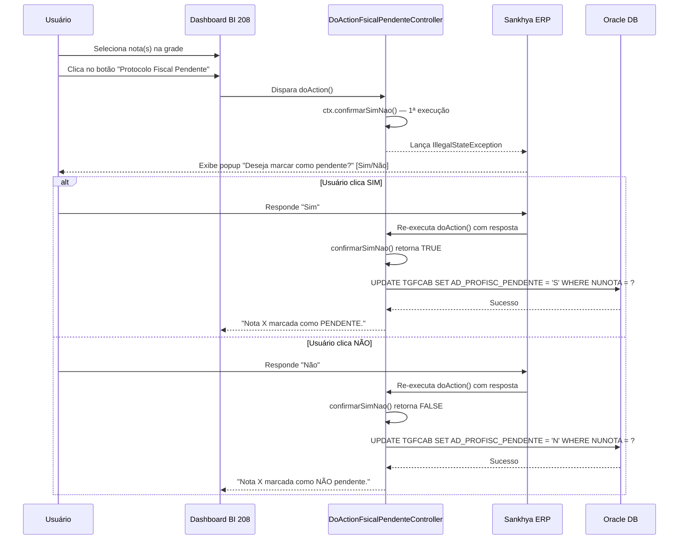

# 📦 Protocolo Fiscal - Botão de Ação Pendente

> Extensão Java para o ERP Sankhya — botão de ação no Dashboard de Protocolo Fiscal para marcar/desmarcar notas como "Pendente de Protocolo Fiscal".

---

## 📋 Sobre o Projeto

Este projeto é uma customização Sankhya composta por:

- **Botão de Ação (Sim/Não):** Exibe um diálogo de confirmação ao usuário, permitindo marcar ou desmarcar a flag `AD_PROFISC_PENDENTE` diretamente pelo Dashboard de Protocolo Fiscal (BI 208).
- **Atualização via NativeSql:** Executa `UPDATE` na tabela `TGFCAB` para persistir a decisão do usuário.

---

## 🛠 Estrutura do Projeto

```
br.com.argo.protocolo.fiscal
├── controller/
│   └── DoActionFsicalPendenteController.java   # Botão de Ação (confirmarSimNao)
```

---

## 📖 Detalhes da Classe

### `DoActionFsicalPendenteController.java`

Implementa `AcaoRotinaJava` e é acionada pelo botão de ação no componente Tabela do Dashboard BI 208.

**Responsabilidades:**

- Itera sobre as linhas selecionadas na grade (`ctx.getLinhas()`).
- Recupera `NUNOTA` e `AD_PROFISC_PENDENTE` do registro selecionado.
- Exibe diálogo **Sim/Não** via `ctx.confirmarSimNao()` (índice 0).
- **Sim** → Executa `ProtocoloFsicalPendente(nUnico, "S")` → Atualiza `AD_PROFISC_PENDENTE = 'S'`.
- **Não** → Executa `ProtocoloFsicalPendente(nUnico, "N")` → Atualiza `AD_PROFISC_PENDENTE = 'N'`.
- Propaga `IllegalStateException` para que o Sankhya exiba o popup de confirmação corretamente.
- Retorna mensagem de confirmação ao usuário via `ctx.setMensagemRetorno()`.

**Método `DataEnvioProtocolo(BigDecimal nUnico, String pendente)`:**

- Executa `UPDATE TGFCAB SET AD_PROFISC_PENDENTE = :AD_PROFISC_PENDENTE WHERE NUNOTA = :NUNOTA` via `NativeSql`.
- Gerencia sessão com `JapeSession`, `JdbcWrapper` e `NativeSql`.
- Libera recursos no bloco `finally`.

---

## 💻 Código-Fonte

```java
public class DoActionFsicalPendenteController implements AcaoRotinaJava {

    @Override
    public void doAction(ContextoAcao ctx) throws Exception {
        Registro[] linhas = ctx.getLinhas();
        JapeSession.SessionHandle hnd = JapeSession.open();

        try {
            for (Registro registro : linhas) {
                BigDecimal nUnico = (BigDecimal) registro.getCampo("NUNOTA");

                if (ctx.confirmarSimNao("Protocolo Fiscal",
                        "Deseja marcar como pendente?", 0)) {
                    DataEnvioProtocolo(nUnico, "S");
                    ctx.setMensagemRetorno("Nota " + nUnico + " marcada como PENDENTE.");
                } else {
                    DataEnvioProtocolo(nUnico, "N");
                    ctx.setMensagemRetorno("Nota " + nUnico + " marcada como NÃO pendente.");
                }
            }

        } catch (IllegalStateException ise) {
            // DEIXA PASSAR — o Sankhya precisa dessa exceção pra exibir o popup
            throw ise;
        } catch (Exception e) {
            e.printStackTrace();
            ctx.setMensagemRetorno("Erro: " + e.getMessage());
        } finally {
            JapeSession.close(hnd);
        }
    }

    public void DataEnvioProtocolo(BigDecimal nUnico, String pendente) throws Exception {
        JapeSession.SessionHandle hnd = null;
        JdbcWrapper jdbc = null;
        NativeSql query = null;
        try {
            String update = "UPDATE TGFCAB SET AD_PROFISC_PENDENTE = :AD_PROFISC_PENDENTE WHERE NUNOTA = :NUNOTA";
            hnd = JapeSession.open();
            hnd.setCanTimeout(false);
            hnd.setFindersMaxRows(-1);
            EntityFacade entity = EntityFacadeFactory.getDWFFacade();
            jdbc = entity.getJdbcWrapper();
            jdbc.openSession();

            query = new NativeSql(jdbc);
            query.appendSql(update);
            query.setNamedParameter("AD_PROFISC_PENDENTE", pendente);
            query.setNamedParameter("NUNOTA", nUnico);
            query.executeUpdate();

        } catch (Exception e) {
            e.printStackTrace();
            throw new Exception("Erro ao atualizar Protocolo Fiscal Pendente: " + e.getMessage());
        } finally {
            JapeSession.close(hnd);
            JdbcWrapper.closeSession(jdbc);
            NativeSql.releaseResources(query);
        }
    }
}
```

---

## 🗄 Requisitos de Banco de Dados (Oracle)

### Tabelas Utilizadas

| Tabela Banco | Instância Java     | Descrição                        |
|--------------|--------------------|----------------------------------|
| `TGFCAB`     | `CabecalhoNota`    | Cabeçalho de Notas/Pedidos       |

### Campo Customizado na `TGFCAB`

| Campo                  | Tipo        | Descrição                              |
|------------------------|-------------|----------------------------------------|
| `AD_PROFISC_PENDENTE`  | VARCHAR2(1) | Flag de Protocolo Fiscal Pendente (S/N)|

### Query do Dashboard BI 208 — CASE do Campo

```sql
CASE
    WHEN CAB.AD_PROFISC_PENDENTE = 'S' THEN 'Sim'
    WHEN CAB.AD_PROFISC_PENDENTE = 'N' THEN 'Não'
    ELSE 'Não Informado'
END AS AD_PROFISC_PENDENTE
```

---

## 🚀 Guia de Implantação (Deploy)

### 1. Compilação

Gere o arquivo `.jar` do projeto contendo a classe compilada.

### 2. Cadastro do Módulo Java

| Passo | Ação |
|-------|------|
| 1     | Acesse a tela **Módulo Java** no Sankhya |
| 2     | Clique em **+** para adicionar novo registro |
| 3     | **Descrição:** `PROTOCOLO-FISCAL-PENDENTE` |
| 4     | Na aba **Arquivo Módulo (Jar):** faça upload do `.jar` |
| 5     | Anote o **código do módulo** gerado |

### 3. Configuração do Botão de Ação

Para que o botão apareça **somente** no Dashboard 208, crie uma nova instância:

#### 3.1 — Criar Instância no Dicionário de Dados

| Passo | Ação |
|-------|------|
| 1     | Acesse **Configurações > Avançado > Dicionário de Dados** |
| 2     | Pesquise pela tabela **TGFCAB** |
| 3     | Crie uma nova instância: **Nome** = `CabProtocoloFiscal`, **Descrição** = `Protocolo Fiscal` |
| 4     | Aponte a tabela para `TGFCAB` |

#### 3.2 — Vincular no Dashboard BI 208

| Passo | Ação |
|-------|------|
| 1     | Acesse **Construtor de Componentes de BI** → Dashboard 208 |
| 2     | Edite o componente **Tabela** |
| 3     | No campo **Entidade**, troque de `CabecalhoNota` para `CabProtocoloFiscal` |
| 4     | Salve o componente |

> ⚠️ **Resultado:** Somente o botão "Protocolo Fiscal Pendente" aparecerá no dashboard, sem as demais ações da entidade `CabecalhoNota`.

---

## 🔄 Fluxo de Funcionamento

### Fluxo: Marcar/Desmarcar Protocolo Fiscal Pendente



---

## ⚠️ Observações Importantes

- **IllegalStateException:** O `catch (IllegalStateException ise) { throw ise; }` é **obrigatório** antes do `catch (Exception e)`. Sem ele, o Sankhya não consegue exibir o popup de confirmação Sim/Não.
- **Índice do diálogo:** O terceiro parâmetro do `confirmarSimNao()` (índice `0`) deve ser único por diálogo. Se encadear múltiplas confirmações, use `0`, `1`, `2`, etc.
- **Mecanismo de duas chamadas:** O Sankhya re-executa a ação do zero após o usuário responder. Na 1ª execução, o método lança a exceção (popup). Na 2ª execução, retorna `true`/`false`.
- **Instância separada:** A instância `CabProtocoloFiscal` garante que somente esta ação apareça no Dashboard 208, sem poluir as Centrais com botões extras.
- **Banco de dados:** Otimizado para **Oracle** (parâmetros nomeados via `NativeSql`).

---

## 📝 Changelog

| Versão | Data       | Tipo     | Descrição |
|--------|------------|----------|-----------|
| 1.0.0  | 2025-03-13 | feat     | Implementação inicial do botão de ação com diálogo Sim/Não |
| 1.0.1  | 2025-03-13 | fix      | Adição do `catch (IllegalStateException)` para popup funcionar |
| 1.0.2  | 2025-03-13 | fix      | CASE na query do dashboard para exibir Sim/Não/Não Informado |
| 1.1.0  | 2025-03-13 | refactor | Criação da instância `CabProtocoloFiscal` para isolar botão no BI 208 |

---

## 🧑‍💻 Autor

**Natan (Natanael Lopes)** — Backend Developer @ Argo Fruta

---

## 📄 Licença

Projeto proprietário — uso interno Argo Fruta.
